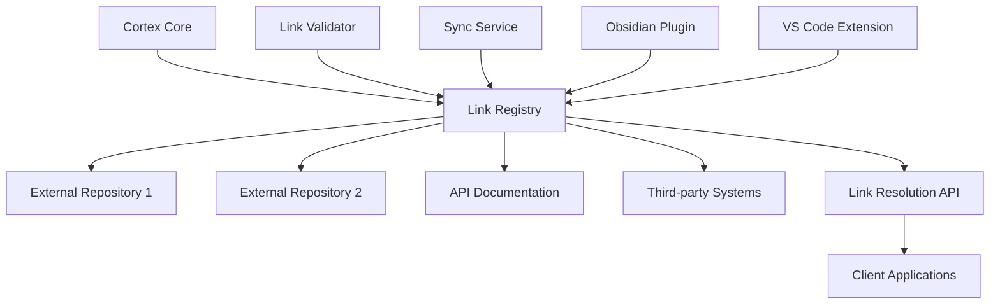

# Cross-Vault Linking

## Overview

Cross-Vault Linking enables seamless connections between different repositories, knowledge bases, and external systems within the Cortex ecosystem. This system maintains referential integrity across distributed content while providing a unified navigation experience.

## Architecture



## Core Components

### 1. Link Registry

Central repository that maintains mappings between logical names and actual resource locations.

```json
{
  "links": {
    "api-standards.md": {
      "type": "external_file",
      "locations": [
        {
          "repository": "api-documentation",
          "path": "/standards/api-standards.md",
          "url": "https://github.com/org/api-docs/blob/main/standards/api-standards.md",
          "last_verified": "2025-08-10T10:00:00Z"
        }
      ],
      "fallback": "/00-System/Cross-Vault-Linker/stubs/api-standards.md"
    }
  }
}
```

### 2. Link Resolution Service

API service that resolves cross-vault references to their current locations.

#### Endpoints

```
GET  /api/v1/links/resolve?target={link_name}
POST /api/v1/links/batch-resolve
GET  /api/v1/links/health
PUT  /api/v1/links/register
```

#### Resolution Process

1. **Local Resolution**: Check if target exists in current vault
2. **Registry Lookup**: Query link registry for external mappings
3. **Fallback Handling**: Use stub content if external resource unavailable
4. **Caching**: Cache successful resolutions for performance

### 3. Synchronization Service

Automated service that keeps cross-vault links current and validates availability.

#### Sync Operations

- **Daily Health Checks**: Verify all registered external links
- **Content Synchronization**: Update local stubs from external sources
- **Broken Link Detection**: Identify and report failed resolutions
- **Registry Updates**: Maintain current location mappings

## Link Types and Patterns

### Internal Cross-Vault Links

Links between different sections of the Cortex system.

```markdown
# Standard internal links
[[System-Workflows]]                    # Core system document
[[03-Decisions/ADR-001-JWT-vs-Sessions]] # Specific ADR reference

# Cross-project references
[[Project-Alpha/Architecture-Overview]]  # Project-specific documentation
[[EXTERNAL-PROJECTS/Test-Workspace-Validation/API-Design-Patterns]] # External project
```

### External Repository Links

Links to content in external repositories and systems.

```markdown
# External file references
[[ADR-004-API-Design-Approach]]       # API design standards
[[Python-FastAPI-Patterns]]       # REST implementation patterns
[[project-overview.md]]    # Project overview in external repo

# Direct external links
[API Standards](https://github.com/org/api-docs/blob/main/standards/api-standards.md)
```

### Stub and Fallback Content

Local placeholder content when external resources are unavailable.

```markdown
# Stub content structure
# API Standards (Stub)

> **Note**: This is a stub document. The complete content is maintained in the external API documentation repository.
> 
> **External Source**: [api-standards.md](https://github.com/org/api-docs/blob/main/standards/api-standards.md)
> **Last Sync**: 2025-08-10 10:00:00 UTC

## Overview
[Local summary of external content]

## Quick Reference
[Key points for immediate use]

---
*For complete documentation, see the external source above.*
```

## Implementation

### Link Registry Database

```sql
-- Cross-vault link registry
CREATE TABLE cross_vault_links (
  id UUID PRIMARY KEY DEFAULT gen_random_uuid(),
  link_name VARCHAR(255) UNIQUE NOT NULL,
  link_type VARCHAR(50) NOT NULL, -- 'external_file', 'external_system', 'cross_project'
  target_repository VARCHAR(255),
  target_path TEXT,
  target_url TEXT,
  fallback_path TEXT,
  last_verified_at TIMESTAMP,
  is_active BOOLEAN DEFAULT TRUE,
  metadata JSONB,
  created_at TIMESTAMP DEFAULT NOW(),
  updated_at TIMESTAMP DEFAULT NOW()
);

-- Link resolution cache
CREATE TABLE link_resolution_cache (
  link_name VARCHAR(255) PRIMARY KEY,
  resolved_url TEXT NOT NULL,
  content_hash VARCHAR(64),
  cached_at TIMESTAMP DEFAULT NOW(),
  expires_at TIMESTAMP NOT NULL
);

-- Link health tracking
CREATE TABLE link_health_log (
  id UUID PRIMARY KEY DEFAULT gen_random_uuid(),
  link_name VARCHAR(255) NOT NULL,
  check_timestamp TIMESTAMP DEFAULT NOW(),
  status VARCHAR(20) NOT NULL, -- 'success', 'failed', 'timeout'
  response_time_ms INTEGER,
  error_message TEXT,
  http_status_code INTEGER
);
```

### Obsidian Plugin Integration

Custom plugin that enhances Obsidian's linking capabilities for cross-vault scenarios.

#### Features

- **Automatic Link Resolution**: Transparent resolution of cross-vault links
- **Link Health Indicators**: Visual indicators for link status
- **Smart Suggestions**: Auto-complete for registered external links
- **Sync Status**: Real-time sync status for external content

#### Configuration

```json
{
  "crossVaultLinking": {
    "registryUrl": "https://api.cortex.com/v1/links",
    "cacheTimeout": 3600,
    "healthCheckInterval": 86400,
    "fallbackBehavior": "show_stub",
    "enableAutoSync": true
  }
}
```

### VS Code Extension

Extension that provides cross-vault linking support in VS Code environments.

#### Commands

- `Cortex: Resolve Cross-Vault Link` - Manually resolve a link
- `Cortex: Sync External Content` - Update local stubs
- `Cortex: Validate All Links` - Run comprehensive link validation
- `Cortex: Register New External Link` - Add new cross-vault reference

## Content Synchronization

### Automated Sync Strategies

#### Pull-Based Synchronization

```yaml
sync_schedule:
  daily_health_check: "02:00 UTC"
  content_sync: "04:00 UTC"
  registry_update: "06:00 UTC"

sync_policies:
  api_standards:
    source: "https://api.github.com/repos/org/api-docs/contents/standards"
    sync_frequency: "daily"
    conflict_resolution: "external_wins"
  
  project_overviews:
    source: "https://api.github.com/repos/org/projects/contents/README.md"
    sync_frequency: "weekly"
    conflict_resolution: "manual_review"
```

#### Push-Based Notifications

Webhook-based updates when external content changes.

```javascript
// Webhook handler for external content updates
app.post('/webhooks/content-updated', async (req, res) => {
  const { repository, path, action } = req.body;
  
  if (action === 'updated') {
    await syncExternalContent(repository, path);
    await invalidateLinkCache(getLinkName(repository, path));
    await notifyStakeholders(repository, path);
  }
  
  res.status(200).json({ status: 'processed' });
});
```

### Conflict Resolution

Handling conflicts when both local and external content have changed.

#### Resolution Strategies

1. **External Wins**: Always prefer external content (default for API docs)
2. **Local Wins**: Prefer local modifications (for customized content)
3. **Manual Review**: Flag conflicts for human resolution
4. **Merge Strategy**: Attempt intelligent merging of changes

## Link Health Monitoring

### Health Check Metrics

- **Availability**: Percentage of successful link resolutions
- **Response Time**: Average time to resolve external links  
- **Content Freshness**: Time since last successful content sync
- **Error Rates**: Frequency of resolution failures by type

### Alerting and Notifications

```yaml
alerts:
  critical:
    - link_availability < 95%
    - sync_failures > 3 consecutive
    - response_time > 5000ms average
  
  warning:
    - link_availability < 98%
    - content_age > 7 days
    - cache_hit_rate < 80%

notification_channels:
  - email: devops-team@company.com
  - slack: "#cortex-alerts"
  - webhook: "https://monitoring.company.com/cortex-webhooks"
```

### Dashboard and Reporting

Real-time dashboard showing cross-vault linking health and metrics.

#### Key Visualizations

- Link health heatmap by repository
- Resolution time trends
- Sync success rates over time
- Most frequently accessed external content
- Broken link reports with resolution recommendations

## Security and Access Control

### Authentication for External Resources

Secure authentication for accessing private repositories and systems.

```yaml
authentication:
  github:
    type: "oauth_token"
    token_env: "GITHUB_ACCESS_TOKEN"
    scopes: ["repo:read"]
  
  internal_apis:
    type: "service_account"
    key_file: "/secrets/service-account.json"
    
  documentation_sites:
    type: "api_key"
    header: "X-API-Key"
    key_env: "DOCS_API_KEY"
```

### Access Control Policies

Control which users and systems can access cross-vault content.

#### Permission Matrix

| Resource Type | Internal Users | External Partners | Public | Service Accounts |
|---------------|---------------|-------------------|---------|------------------|
| **Public Docs** | Read/Write | Read | Read | Read |
| **API Specs** | Read/Write | Read | None | Read |
| **Internal ADRs** | Read/Write | None | None | Read |
| **Project Plans** | Read/Write | Conditional | None | None |

## Related Documentation

- [[System-Workflows]] - Integration with content workflows
- [[Quality-Gates]] - Link validation as part of quality gates
- Obsidian Integration - Obsidian-specific implementation details (archived)
- [[ADR-004-API-Design-Approach]] - External API integration patterns
- [[00-System/Test-Tools]] - Automated link validation tools

## Troubleshooting Guide

### Common Issues and Solutions

#### Link Resolution Failures

**Symptom**: Cross-vault links return 404 or timeout errors
**Diagnosis**: Check link registry and external resource availability
**Solution**: Update registry mappings, verify authentication, check network connectivity

#### Sync Conflicts  

**Symptom**: External content sync fails with merge conflicts
**Diagnosis**: Both local and external content modified simultaneously
**Solution**: Review conflicts manually, choose resolution strategy, update sync policies

#### Performance Degradation

**Symptom**: Slow link resolution times affecting user experience
**Diagnosis**: Cache misses, network latency, or external service performance
**Solution**: Optimize caching strategy, add geographic distribution, implement fallbacks

---

*Cross-Vault Linking is continuously evolved based on integration requirements and user feedback. This system enables the Cortex ecosystem to scale across multiple repositories while maintaining coherent navigation and content relationships.*
