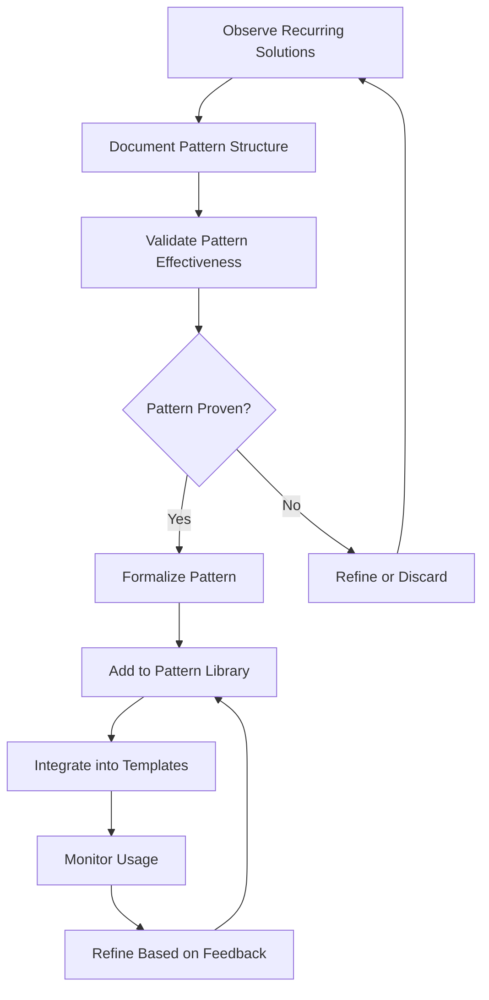

# Pattern-Analysis

## Overview

Pattern Analysis is the systematic identification, documentation, and application of recurring solutions, structures, and approaches within the Cortex ecosystem. This process enables knowledge reuse, consistency improvement, and accelerated decision-making through pattern recognition.

## Pattern Identification Process

## Pattern Categories

### 1. Architectural Patterns

Recurring solutions in system and component design.

#### Decision Architecture Pattern

**Context**: Need for consistent, traceable decision documentation
**Pattern**: ADR-based decision records with confidence assessment
**Structure**:

- Problem statement and context
- Considered alternatives with trade-offs
- Selected solution with rationale
- Confidence assessment using [[Confidence Calculator]]
- Implementation timeline and success criteria

**Applications**:

- [[ADR-001-JWT-vs-Sessions]] - Authentication approach
- [[ADR-002-Password-Hashing]] - Security implementation
- [[ADR-004-API-Design-Approach]] - System interface design

#### Progressive API Complexity Pattern

**Context**: Need to balance API simplicity with comprehensive functionality
**Pattern**: Layered API design with progressive disclosure of complexity
**Structure**:

- Core simple endpoints for common use cases
- Advanced endpoints for power users
- Batch operations for efficiency
- Comprehensive documentation with examples

**Applications**:

- [[Progressive-API-Complexity-Pattern]] - Detailed pattern documentation
- REST API design across Cortex services
- Integration API development

### 2. Content Patterns

Recurring structures in documentation and knowledge management.

#### Template-Driven Consistency Pattern

**Context**: Need for consistent structure across similar content types
**Pattern**: Standardized templates with required and optional sections
**Structure**:

- Template definition with clear sections
- Guidance for content creators
- Validation rules for completeness
- Cross-linking requirements

**Applications**:

- [[ADR-Enhanced]] - Decision record template
- [[Project-Workspace]] - Project documentation template
- [[Data-Repository]] - Insight documentation template

#### Cross-Vault Reference Pattern

**Context**: Need to link content across different repositories and systems
**Pattern**: Standardized referencing with fallback mechanisms
**Structure**:

- Logical link names independent of location
- Central registry for link resolution
- Fallback content for unavailable external resources
- Health monitoring and automatic updates

**Applications**:

- [[Cross-Vault Linking]] - Implementation details
- External API documentation references
- Inter-project documentation links

### 3. Process Patterns

Recurring workflow and operational approaches.

#### Confidence-Driven Decision Making

**Context**: Need to quantify decision quality and track outcomes
**Pattern**: Systematic confidence assessment with outcome tracking
**Structure**:

- Evidence-based confidence calculation
- Standardized confidence metrics
- Decision outcome tracking
- Feedback loop for model refinement

**Applications**:

- All ADR processes use confidence assessment
- [[Confidence Calculator]] provides methodology
- [[System-Workflows]] incorporate confidence thresholds

#### Quality Gate Progression

**Context**: Need for consistent quality standards across content types
**Pattern**: Multi-stage validation with automated and manual checkpoints
**Structure**:

- Automated validation (syntax, links, structure)
- Peer review with role-based assignment
- Integration testing for system consistency
- Security validation for sensitive content

**Applications**:

- [[Quality-Gates]] - Comprehensive implementation
- [[System-Workflows]] - Integration with content processes
- [[00-System/Test-Tools]] - Automated validation tools

## Pattern Analysis Methods

### 1. Pattern Mining

Systematic discovery of patterns from existing content and decisions.

#### Data Sources

- Historical ADR decisions and outcomes
- Content structure analysis across repositories
- Workflow performance metrics
- User feedback and pain points

#### Analysis Techniques

- **Frequency Analysis**: Identify commonly repeated structures
- **Outcome Correlation**: Link patterns to successful outcomes
- **Anomaly Detection**: Identify deviations from successful patterns
- **Cluster Analysis**: Group similar solutions for pattern extraction

### 2. Pattern Validation

Verification that identified patterns provide consistent value.

#### Validation Criteria

- **Effectiveness**: Pattern improves outcomes compared to ad-hoc approaches
- **Reusability**: Pattern applies across multiple contexts
- **Simplicity**: Pattern reduces complexity rather than adding it
- **Maintainability**: Pattern supports long-term system evolution

#### Validation Methods

- A/B testing of pattern-based vs. ad-hoc approaches
- Retrospective analysis of pattern adoption outcomes
- User feedback on pattern utility and clarity
- Quantitative analysis of pattern impact on key metrics

### 3. Pattern Evolution

Continuous refinement and adaptation of patterns based on usage and feedback.

#### Evolution Triggers

- Changes in technology landscape
- New requirements or constraints
- Consistent pattern violations indicating need for refinement
- User feedback suggesting improvements

#### Evolution Process

1. **Pattern Performance Review**: Regular assessment of pattern effectiveness
2. **Gap Analysis**: Identify areas where current patterns don't address needs
3. **Refinement Proposal**: Suggest specific pattern improvements
4. **Impact Assessment**: Evaluate effects of pattern changes
5. **Gradual Rollout**: Implement pattern updates with change management

## Pattern Library

### Current Pattern Inventory

| Pattern Name | Category | Maturity | Usage Count | Last Updated |
|--------------|----------|----------|-------------|--------------|
| **ADR Decision Structure** | Architectural | Mature | 25+ | 2025-08-10 |
| **Template-Driven Content** | Content | Mature | 15+ | 2025-08-10 |
| **Cross-Vault Linking** | Content | Developing | 8+ | 2025-08-10 |
| **Quality Gate Progression** | Process | Mature | System-wide | 2025-08-10 |
| **Confidence Assessment** | Process | Developing | 12+ | 2025-08-10 |
| **Progressive API Complexity** | Architectural | Emerging | 3+ | 2025-08-10 |

### Pattern Maturity Levels

- **Emerging**: Early identification, limited validation
- **Developing**: Some validation, growing usage
- **Mature**: Proven effectiveness, widespread adoption
- **Legacy**: Previously effective, being phased out

## Pattern Application Guidelines

### When to Apply Patterns

- **New Project Initialization**: Use established patterns as starting point
- **Problem Recognition**: When facing similar challenges to previous solutions
- **Consistency Requirements**: When uniformity across components is important
- **Knowledge Transfer**: When bringing new team members up to speed

### Pattern Customization

While patterns provide structure, they should be adapted to specific contexts:

- Assess pattern fit for current situation
- Identify required customizations or extensions
- Document deviations with rationale
- Contribute improvements back to pattern library

### Anti-Patterns to Avoid

- **Pattern Overuse**: Forcing patterns where they don't naturally fit
- **Premature Patterning**: Creating patterns before sufficient examples exist
- **Pattern Rigidity**: Refusing to adapt patterns to new contexts
- **Pattern Neglect**: Failing to maintain and evolve patterns over time

## Integration with System Workflows

### Pattern-Informed Decision Making

- ADR processes reference relevant patterns
- New decisions evaluate against existing pattern library
- Pattern deviations require explicit justification
- Pattern effectiveness feeds into confidence calculations

### Template and Tool Integration

- Content templates incorporate proven patterns
- Automated tools validate pattern compliance
- IDE extensions suggest relevant patterns
- Documentation systems highlight pattern usage

### Training and Onboarding

- New team members learn through pattern examples
- Pattern workshops for knowledge sharing
- Best practice documentation references patterns
- Mentoring programs emphasize pattern recognition

## Metrics and Measurement

### Pattern Effectiveness Metrics

- **Adoption Rate**: Percentage of applicable situations using patterns
- **Success Correlation**: Outcomes when patterns are vs. aren't used
- **Time to Solution**: Speed of problem resolution with pattern guidance
- **Consistency Score**: Structural similarity across pattern applications

### Pattern Evolution Metrics

- **Pattern Refinement Rate**: Frequency of pattern updates
- **User Satisfaction**: Feedback scores on pattern utility
- **Coverage Gaps**: Areas lacking appropriate patterns
- **Innovation Rate**: Creation of new patterns to address emerging needs

## Future Directions

### Advanced Pattern Analysis

- **Machine Learning**: Automated pattern discovery from large content sets
- **Semantic Analysis**: Understanding conceptual patterns beyond structural ones
- **Predictive Modeling**: Anticipating which patterns will be successful
- **Cross-Domain Transfer**: Applying patterns across different problem domains

### Tool Development

- **Pattern Recommendation Engine**: AI-powered suggestions for pattern application
- **Pattern Compliance Automation**: Automated validation of pattern adherence
- **Pattern Evolution Tracking**: Version control and change management for patterns
- **Collaborative Pattern Development**: Tools for distributed pattern creation

## Related Documentation

- [[Confidence Calculator]] - Confidence assessment pattern implementation
- [[Quality-Gates]] - Quality gate progression pattern
- [[System-Workflows]] - Pattern integration with core processes
- [[ADR-Enhanced]] - Decision architecture pattern template
- [[Cross-Vault Linking]] - Cross-vault reference pattern
- [[Progressive-API-Complexity-Pattern]] - Detailed API complexity pattern

## Contributing to Pattern Analysis

### Pattern Submission Process

1. **Observation**: Identify recurring solution or structure
2. **Documentation**: Create initial pattern description
3. **Validation**: Gather evidence of pattern effectiveness  
4. **Review**: Submit for community review and feedback
5. **Refinement**: Iterate based on feedback
6. **Integration**: Add to pattern library and update templates

### Pattern Review Criteria

- Clear problem statement and context
- Concrete structure with implementation details
- Evidence of effectiveness across multiple applications
- Consideration of alternatives and trade-offs
- Integration plan with existing patterns and tools

---

*Pattern Analysis is a continuous process that evolves with the Cortex system. Through systematic pattern identification, validation, and application, we build a knowledge base that accelerates problem-solving and ensures consistent high-quality solutions across all system components.*
