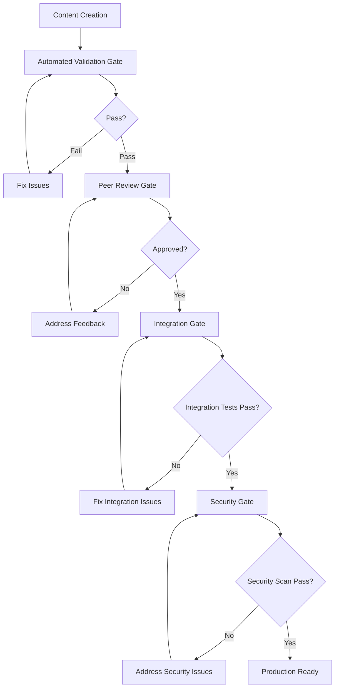

# Quality-Gates

## Overview

Quality Gates define the criteria and checkpoints that ensure consistent quality standards across all Cortex system components. These gates operate at different levels of the development and content creation lifecycle.

## Gate Hierarchy



## Gate Definitions

### 1. Automated Validation Gate

**Purpose**: Ensure basic quality and structural integrity before human review.

#### Criteria

- **Template Compliance**: Content follows designated template structure
- **Link Validation**: All internal links resolve correctly
- **Syntax Validation**: Markdown syntax is correct
- **Metadata Completeness**: Required fields are populated
- **Confidence Assessment**: Decision documents include confidence calculations

#### Tools

- `cortex-test-framework` for link validation
- `ai-link-advisor.py` for AI-powered link suggestions
- Template structure validators
- Markdown linters (markdownlint)
- Custom validation scripts

#### Thresholds

- **Link Health**: >95% valid links required
- **Template Compliance**: 100% for required sections
- **Metadata Quality**: All mandatory fields completed
- **Syntax Errors**: Zero tolerance for syntax issues
- **AI Suggestion Quality**: >80% confidence for auto-application

### 2. Peer Review Gate

**Purpose**: Human validation of content quality, accuracy, and consistency.

#### Review Types

##### Technical Content Review

- **Scope**: ADRs, architectural decisions, technical documentation
- **Reviewers**: 2+ technical stakeholders, including 1 senior architect
- **Criteria**:
  - Technical accuracy and feasibility
  - Alignment with system architecture
  - Consideration of alternatives
  - Risk assessment completeness

##### Content Quality Review  

- **Scope**: General documentation, insights, process documentation
- **Reviewers**: 1+ content owner, 1+ domain expert
- **Criteria**:
  - Clarity and readability
  - Completeness of information
  - Consistency with existing content
  - Appropriate cross-linking

##### Security Review

- **Scope**: Authentication, authorization, data handling decisions
- **Reviewers**: Security team member + architect
- **Criteria**:
  - Security implications assessed
  - Compliance with security standards
  - Privacy considerations addressed
  - Threat model completeness

#### Review Process

1. **Automated Assignment**: Based on content type and expertise
2. **Review Timeline**: 48-72 hours for standard content, 5+ days for major decisions
3. **Feedback Integration**: Authors must address all feedback before approval
4. **Approval Tracking**: Digital signatures and timestamps

### 3. Integration Gate

**Purpose**: Verify that changes integrate properly with the broader system.

#### Integration Tests

- **Cross-Reference Validation**: New content properly links to related materials
- **System Consistency**: Changes don't break existing workflows
- **Navigation Integrity**: Content is discoverable through standard navigation
- **Search Integration**: Content is properly indexed and searchable

#### Automated Checks

```bash
# Example integration validation
./test-manager-enhanced.sh link-validation --comprehensive
./test-manager-enhanced.sh cross-reference-check
./test-manager-enhanced.sh navigation-integrity
```

#### Success Criteria

- All automated integration tests pass
- No broken links introduced
- Proper bidirectional linking established
- Content accessible through expected pathways

### 4. AI Suggestion Validation Gate

**Purpose**: Validate AI-generated link suggestions before application.

#### Validation Criteria

##### Confidence-Based Processing

- **≥90% Confidence**: Auto-apply with monitoring
- **80-89% Confidence**: Require human review and approval
- **70-79% Confidence**: Flag for expert review
- **<70% Confidence**: Reject automatically

##### Quality Checks

- **Semantic Context**: Suggested link maintains original meaning
- **File Existence**: Target file exists and is accessible
- **Cross-Reference Integrity**: No circular references created
- **Template Compliance**: Link fits existing template structure
- **Domain Consistency**: Suggestion aligns with document domain

#### Validation Process

1. **Automated Screening**: Filter suggestions by confidence threshold
2. **Context Analysis**: Verify semantic similarity claims
3. **Technical Validation**: Confirm target file accessibility
4. **Human Review**: Manual approval for medium-confidence suggestions
5. **Application Tracking**: Monitor applied suggestions for effectiveness

#### Validation Tools

- `ai-link-advisor.py validate` - Automated validation pipeline
- Context similarity analyzers
- File existence checkers
- Cross-reference validators

#### Success Metrics

- **Validation Accuracy**: >95% correct acceptance/rejection decisions
- **Processing Time**: <2 minutes for automated validation
- **Human Review Quality**: <5% false positives in approved suggestions
- **Applied Suggestion Success**: >90% of applied suggestions remain valid after 30 days

### 5. Security Gate

**Purpose**: Ensure security considerations are properly addressed.

#### Security Validation Types

##### Content Security

- **Sensitive Information**: No credentials, keys, or PII in documentation
- **Access Control**: Proper classification and access restrictions
- **Compliance**: Adherence to regulatory requirements

##### System Security

- **Authentication Integration**: Proper auth integration for tools and systems
- **Data Protection**: Encryption and data handling compliance
- **Audit Trail**: Comprehensive logging of access and changes

#### Security Tools

- Automated secret scanning (git-secrets, truffleHog)
- Access control validation
- Compliance checkers (GDPR, SOC2)
- Security policy validation

## Quality Metrics

### Gate Performance Metrics

| Gate | Success Rate Target | Average Processing Time | Escalation Threshold |
|------|-------------------|------------------------|-------------------|
| **Automated Validation** | >98% | <5 minutes | >15 minutes |
| **Peer Review** | >95% first pass | 48 hours | >5 days |
| **Integration** | >99% | <10 minutes | >30 minutes |
| **AI Suggestion Validation** | >95% | <2 minutes | >5 minutes |
| **Security** | >97% | <24 hours | >3 days |

### Content Quality Metrics

- **Link Health Score**: Target >98% valid links
- **Template Compliance**: Target 100% for new content
- **Review Feedback Score**: <2 average feedback items per review
- **Confidence Prediction Accuracy**: >85% alignment with outcomes
- **AI Suggestion Accuracy**: >90% applied suggestions remain valid after 30 days

## Enforcement Mechanisms

### Automated Enforcement

- **Git Hooks**: Pre-commit validation for basic quality checks
- **CI/CD Pipeline**: Automated gate validation on content changes
- **Status Dashboards**: Real-time visibility into gate status
- **Automated Notifications**: Alert stakeholders to gate failures

### Manual Enforcement

- **Review Assignment**: Automatic assignment based on content type
- **Approval Tracking**: Digital approval trails with timestamps
- **Escalation Procedures**: Clear escalation paths for blocked content
- **Quality Audits**: Regular audits of gate effectiveness

## Gate Configuration

### Customizable Thresholds

#### By Content Type

```yaml
quality_gates:
  adr_documents:
    peer_reviewers: 2
    confidence_threshold: 80
    security_review: required
  
  general_documentation:
    peer_reviewers: 1
    confidence_threshold: 70
    security_review: conditional
  
  templates:
    peer_reviewers: 1
    confidence_threshold: 60
    security_review: false
  
  ai_suggestions:
    auto_apply_threshold: 90
    review_required_threshold: 80
    expert_review_threshold: 70
    reject_threshold: 70
```

#### By Risk Level

- **High Risk**: Major architectural decisions, security changes
  - Multiple reviewers required
  - Extended review periods
  - Mandatory security review
  
- **Medium Risk**: Significant feature additions, process changes
  - Standard review requirements
  - Normal timelines
  - Conditional security review

- **Low Risk**: Documentation updates, minor clarifications
  - Single reviewer sufficient
  - Expedited timeline
  - Minimal security requirements

## Integration with System Workflows

### With Decision Process

- ADRs must pass all gates before implementation approval
- Confidence assessments validated at each gate
- Gate results feed back into confidence model refinement

### With Content Management

- All content changes subject to appropriate gates
- Template updates require enhanced review processes
- Cross-vault content changes require integration validation

### With Development Lifecycle

- Code changes that affect documentation trigger gate validation
- Infrastructure changes require security gate approval
- Deployment dependencies on gate completion

## Continuous Improvement

### Gate Effectiveness Measurement

- Monthly gate performance reviews
- Stakeholder feedback collection on gate processes
- Metrics-driven threshold adjustments
- Process optimization based on bottleneck analysis

### Process Evolution

- Regular review of gate criteria and thresholds
- Integration of new tools and validation methods
- Stakeholder input on process improvements
- Alignment with industry best practices

## Related Documentation

- [[System-Workflows]] - Integration with core system processes
- [[Confidence Calculator]] - Decision confidence assessment
- [[ADR-Enhanced]] - Decision document quality requirements
- [[Cross-Vault Linking]] - Inter-repository quality standards
- [[00-System/Test-Tools]] - Automated validation tooling

## Escalation Procedures

### Gate Failure Escalation

1. **Immediate**: Automated notification to content owner
2. **24 hours**: Notification to team lead/project owner
3. **48 hours**: Escalation to engineering management
4. **72 hours**: Executive notification for critical path items

### Review Bottleneck Escalation

1. **Review overdue >24 hours**: Reminder to assigned reviewers
2. **Review overdue >48 hours**: Backup reviewer assignment
3. **Review overdue >5 days**: Management escalation
4. **Critical path blocking**: Immediate management notification

---

*Quality Gates are continuously refined based on system evolution and stakeholder feedback. This document represents current standards and will be updated as processes mature.*
