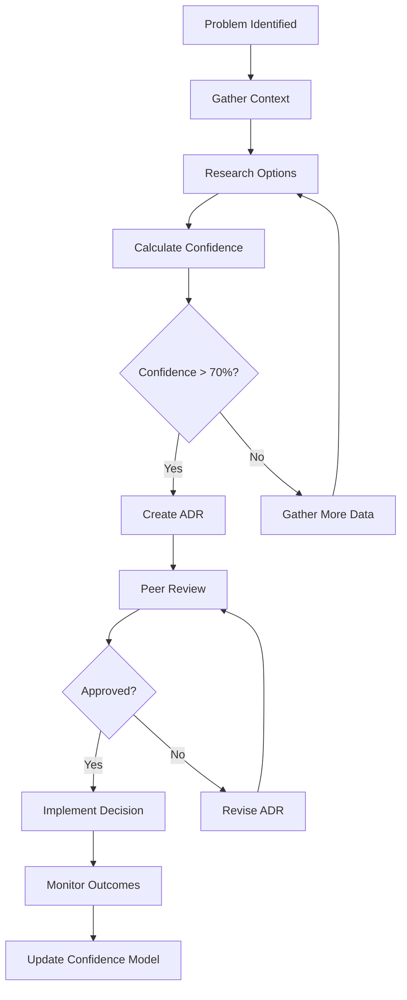
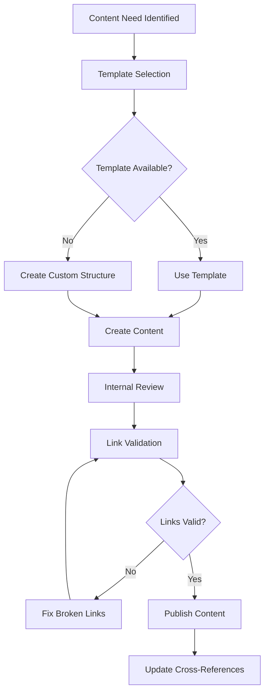
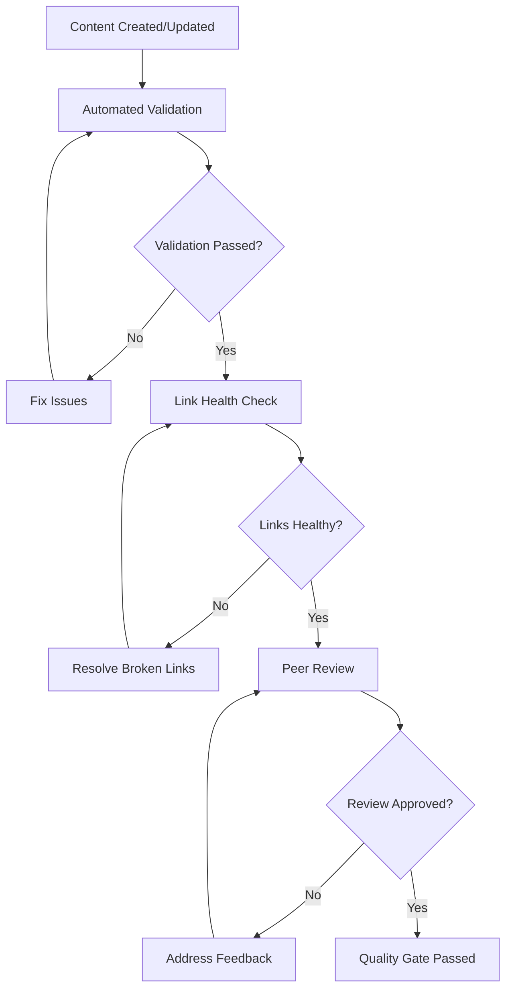
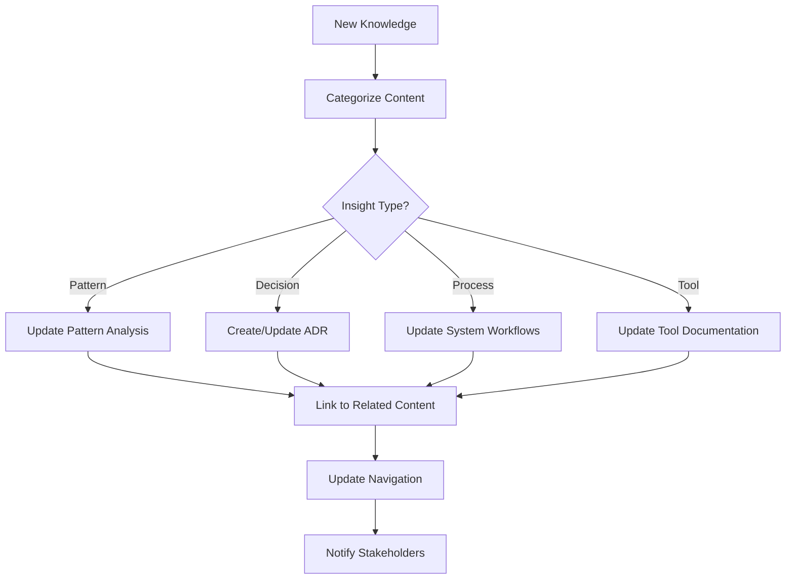

# System-Workflows

## Overview

This document defines the core workflows that govern how the Cortex system operates, from decision-making processes to content creation and quality assurance.

## Core Workflows

### 1. Decision-Making Workflow

#### Process Steps

1. **Problem Identification**
   - Issue documented in project workspace
   - Stakeholders identified
   - Impact assessment completed

2. **Context Gathering**
   - Review existing decisions ([[Decision-Index]])
   - Analyze similar patterns ([[Pattern-Analysis]])
   - Consult relevant expertise

3. **Confidence Assessment**
   - Use [[Confidence Calculator]] methodology
   - Document evidence and assumptions
   - Identify key risk factors

4. **Decision Documentation**
   - Create ADR using [[ADR-Enhanced]] template
   - Link to relevant projects and contexts
   - Include implementation timeline

### 2. Content Creation Workflow

#### Template-Driven Creation

- **Project Documentation**: Use [[Project-Workspace]] template
- **Decision Records**: Use [[ADR-Enhanced]] template
- **Neural Links**: Use [[Cortex Neural-Link]] template
- **Insights**: Use [[Data-Repository]] template

### 3. Quality Assurance Workflow

#### Validation Checkpoints

1. **Automated Validation**
   - Template structure compliance
   - Required fields completion
   - Link syntax validation

2. **Link Health Monitoring**
   - Weekly automated link validation
   - Broken link reporting
   - Cross-vault reference verification

3. **Peer Review Process**
   - Technical accuracy review
   - Consistency with existing patterns
   - Clarity and completeness assessment

### 4. Knowledge Integration Workflow

## Workflow Integration Points

### With Project Management

- Project workspaces follow standard workflows
- Decision points trigger ADR creation
- Quality gates integrated with project milestones

### With Cross-Vault Linking

- Workflows ensure proper cross-references
- Template usage maintains link consistency
- Automated validation prevents broken connections

### With Confidence System

- Decision workflows include confidence assessment
- Quality thresholds based on confidence levels
- Outcome tracking feeds back to confidence model

## Automation and Tools

### Automated Processes

- **Link Validation**: Daily health checks using [[00-System/Test-Tools]]
- **Template Compliance**: Structure validation on content updates
- **Cross-Reference Updates**: Automatic bidirectional linking

### Manual Processes

- **Peer Reviews**: Human judgment required for quality assessment
- **Strategic Decisions**: High-level ADRs need manual stakeholder review
- **Pattern Recognition**: Human insight needed for pattern identification

### Tool Integration

- **Obsidian**: Primary authoring environment
- **VS Code**: Development and automation tools
- **Git**: Version control and collaboration
- **CI/CD**: Automated validation and deployment

## Workflow Metrics

### Decision Quality

- Confidence prediction accuracy
- Decision reversal rate
- Time from problem to resolution

### Content Quality  

- Broken link percentage
- Template compliance rate
- Peer review feedback scores

### Process Efficiency

- Average decision cycle time
- Content creation velocity
- Quality gate pass rate

## Related Documentation

- [[Quality-Gates]] - Specific criteria for workflow checkpoints
- [[Confidence Calculator]] - Decision confidence assessment
- Decision Process - Detailed decision-making procedures (see system workflows)
- [[00-Templates/ADR-Enhanced]] - Standard decision documentation format
- [[Cross-Vault Linking]] - Inter-repository connection protocols

## Continuous Improvement

### Workflow Evolution

- Monthly workflow retrospectives
- Metrics-driven process optimization
- Stakeholder feedback integration

### Tool Enhancement

- Automation opportunity identification
- Integration improvement projects
- User experience optimization

---

*This workflow documentation is maintained as part of the Cortex system governance and is updated based on practical experience and stakeholder feedback.*
