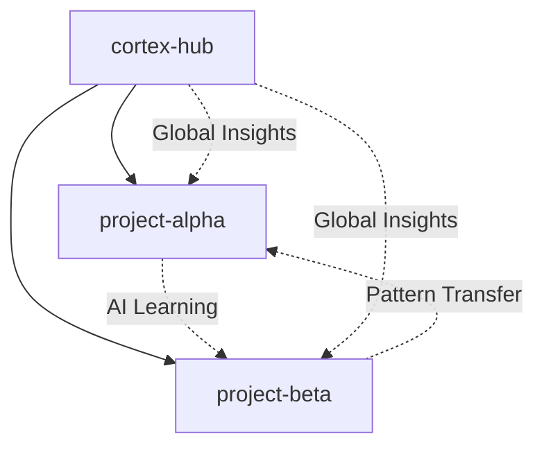

# 🏛️ Cortex Vault Registry

*Central registry and management system for all Cortex project vaults*

## 📊 **Vault Overview**

| Vault Name | Type | Status | Created | Last Active | Projects | AI Learning |
|------------|------|--------|---------|-------------|----------|-------------|
| `cortex-hub` | Hub | 🟢 Active | 2025-08-10 | 2025-08-10 | - | Central Engine |
| `project-alpha` | Project | 🟡 Planned | - | - | 1 | Connected |
| `project-beta` | Project | 🟡 Planned | - | - | 1 | Connected |

## 🎯 **Hub Vault (cortex-hub)**

**Purpose:** Central coordination and AI learning hub  
**Location:** `/Users/simonjanke/Projects/cortex`  
**Role:** Master vault for cross-project learning and coordination

### **Key Components:**
- ✅ Vault Registry (this file)
- ✅ AI Learning Engine
- ✅ Cross-Vault Linker
- ✅ Performance Monitor
- ✅ Global Insights Generator

## 🚀 **Project Vaults**

### **Vault Creation Standards:**

```yaml
vault_structure:
  name: "project-{name}"
  location: "/Users/simonjanke/Projects/project-{name}"
  template: "standard-project-vault"
  ai_learning: enabled
  cross_vault_links: enabled
  performance_monitoring: enabled
```

### **Active Vaults:**

#### **🎯 Project Alpha** (Planned)
- **Type:** Development Project
- **Focus:** [To be defined]
- **Expected Start:** 2025-08-11
- **AI Learning Tags:** `#development`, `#planning`, `#progress`

#### **🎯 Project Beta** (Planned)
- **Type:** Research Project
- **Focus:** [To be defined]
- **Expected Start:** 2025-08-15
- **AI Learning Tags:** `#research`, `#analysis`, `#insights`

## 🧠 **AI Learning Status**

### **Tag Correlation Engine:**
- **Status:** 🟡 In Development
- **Active Correlations:** 0
- **Learning Confidence:** N/A (no data yet)
- **Processing Speed:** Target <30s

### **Pattern Detection:**
- **Status:** 🟡 In Development
- **Detected Patterns:** 0
- **Pattern Accuracy:** Target >85%
- **Cross-Vault Patterns:** 0

### **Insight Generation:**
- **Status:** 🟡 In Development
- **Generated Insights:** 0
- **Insight Applicability:** Target >60%
- **Auto-Suggestions:** 0

## ⚙️ **Vault Management Commands**

### **Create New Project Vault:**
```bash
cortex create-vault --name "project-name" --type project --template standard
```

### **Link Vaults:**
```bash
cortex link-vaults --source "project-alpha" --target "project-beta" --tags "common-tags"
```

### **AI Learning Status:**
```bash
cortex ai-status --vault "all" --show-correlations
```

### **Performance Check:**
```bash
cortex performance --vault "all" --metrics "speed,learning,connections"
```

## 📈 **Performance Metrics**

### **Cross-Vault Performance:**
- **Average Vault Size:** N/A (no project vaults yet)
- **Cross-Vault Search Time:** Target <2s
- **AI Processing Delay:** Target <30s
- **Vault Creation Time:** Target <5min

### **Learning Effectiveness:**
- **Tag Correlation Accuracy:** Target >85%
- **Pattern Suggestion Acceptance:** Target >70%
- **Cross-Project Insight Applicability:** Target >60%

## 🔗 **Cross-Vault Connections**

*Network map of vault relationships and AI-discovered connections*



### **Discovered Connections:**
- **None yet** (system just initialized)
- AI will populate this as it learns patterns

## 🚨 **Vault Health Monitoring**

### **System Health:**
- **Hub Vault:** 🟢 Healthy
- **AI Learning Service:** 🟢 Running
- **Cross-Vault Sync:** 🟢 Operational
- **Performance Monitor:** 🟢 Active

### **Alert Thresholds:**
- **Vault Size:** >1GB (warning), >2GB (critical)
- **Response Time:** >5s (warning), >10s (critical)
- **AI Processing:** >60s (warning), >120s (critical)
- **Sync Errors:** >5/day (warning), >10/day (critical)

## 🔧 **Configuration**

### **AI Learning Settings:**
```yaml
ai_learning:
  tag_correlation_threshold: 0.7
  pattern_detection_confidence: 0.85
  insight_generation_interval: "daily"
  cross_vault_analysis: enabled
  real_time_learning: enabled
```

### **Performance Settings:**
```yaml
performance:
  max_vault_size: "2GB"
  cache_timeout: "1h"
  background_processing: enabled
  parallel_analysis: enabled
```

## 📋 **Next Actions**

### **Immediate (Today):**
- [x] Create ADR-004 for Multi-Vault Architecture
- [x] Set up Vault Registry
- [ ] Implement AI Learning Engine foundation
- [ ] Create standard project vault template

### **Week 1:**
- [ ] Create first test project vault (project-alpha)
- [ ] Implement basic tag correlation
- [ ] Set up cross-vault linking system
- [ ] Test vault creation workflow

### **Week 2:**
- [ ] Add pattern detection capabilities
- [ ] Implement insight generation
- [ ] Create performance monitoring dashboard
- [ ] Test with multiple project vaults

---

**Last Updated:** 2025-08-10  
**Next Review:** 2025-08-17  
**Maintenance:** Weekly  
**Owner:** Cortex AI Learning System


## 📊 **Real-Time Statistics** (Updated: 2025-08-10 21:20)

### **System Performance:**
- **Cycles Completed:** 1
- **Vaults Discovered:** 2
- **Active Cross-Vault Links:** 0
- **Detected Patterns:** 12
- **Tag Correlations:** 14

### **Last Analysis Results:**
- **AI Learning Accuracy:** 4 insights generated
- **Strong Connections:** 0 high-confidence links
- **Vault Connections:** 0 inter-vault relationships